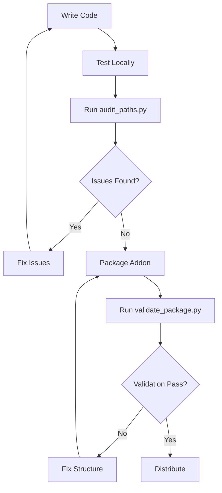

# Validation Tools - User Guide

**Automated tools to ensure cross-platform compatibility**

---

## 📦 Available Tools

### 1. `validate_package.py`
Validates Blender addon ZIP structure and contents.

### 2. `audit_paths.py`
Scans Python files for hardcoded path separators and compatibility issues.

---

## 🚀 Quick Start

### **Option 1: Automatic (Recommended)**

The validation runs automatically when you package the addon:

```bash
# Windows
package_addon.bat

# The script will automatically run validate_package.py if Python is available
```

### **Option 2: Manual Validation**

Run the validation scripts manually:

```bash
# Validate the ZIP package
python validate_package.py styleengine.zip

# Audit Python source files for path issues
python audit_paths.py
```

---

## 📖 Tool Details

### **validate_package.py**

#### Purpose
Checks if your addon ZIP is properly structured for cross-platform installation.

#### What It Checks

✅ **Structure Validation**
- ZIP contains `styleengine/` folder at root
- `__init__.py` is in the correct location
- All required modules are present

✅ **Content Validation**
- `bl_info` exists in `__init__.py`
- macOS fallback import system is present
- No Windows-specific path separators in filenames

✅ **File Hygiene**
- No `__pycache__` directories
- No `.pyc` compiled files
- No excessively large Python files

✅ **Import Safety**
- Relative imports are supported by fallback system
- Modules can reference each other

#### Usage

```bash
python validate_package.py <path_to_zip>
```

#### Examples

```bash
# Validate current package
python validate_package.py styleengine.zip

# Validate package in another location
python validate_package.py C:\Downloads\styleengine_v2.zip
```

#### Output Interpretation

**✅ Success:**
```
✅ VALIDATION PASSED!
✅ Package structure is valid
✅ Ready for cross-platform distribution
```
→ Your package is ready to distribute!

**⚠️ Warnings:**
```
✅ VALIDATION PASSED (with warnings)
✅ No critical errors found
⚠️ Review warnings before distribution

⚠️ WARNINGS (Should review):
  ⚠️ No README.md found (optional but recommended)
  ⚠️ Found 3 cache files (should remove)
```
→ Package works, but consider fixing warnings

**❌ Errors:**
```
❌ VALIDATION FAILED
❌ Fix errors before packaging

❌ ERRORS (Must fix before distribution):
  ❌ ZIP must contain 'styleengine/' folder at root
  ❌ Missing styleengine/__init__.py
```
→ Package won't work - fix errors before distributing

---

### **audit_paths.py**

#### Purpose
Scans Python source files for hardcoded path separators and other cross-platform issues.

#### What It Checks

✅ **Path Separators**
- Hardcoded Windows absolute paths (e.g., `C:\\`)
- Hardcoded backslashes in relative paths
- String concatenation for paths (should use `os.path.join`)

✅ **Temp Directories**
- Hardcoded temp paths (should use `tempfile` module)

✅ **Cross-Platform Patterns**
- Paths that won't work on Unix systems

#### Usage

```bash
python audit_paths.py
```

**Note:** This script scans the `styleengine/` directory in the current working directory.

#### Output Interpretation

**✅ No Issues:**
```
✅ No cross-platform issues found!
✅ All path operations appear to be platform-safe
```
→ Your code is cross-platform safe!

**⚠️ Issues Found:**
```
⚠️ Found potential cross-platform issues:

📄 workspace_setup.py:
  Line 123: Hardcoded backslash in path
    path = base_dir + "\\temp\\file.txt"

📄 prefs.py:
  Line 456: String concatenation for paths
    output = folder + "/" + filename

⚠️ Total: 2 issues in 2 files

Recommendations:
  • Use os.path.join() or pathlib.Path for all path operations
  • Use .replace('\\', '/') when sending paths to external systems
  • Test on macOS/Linux before release
```
→ Fix these issues before release

#### Common Issues & Fixes

**Issue: Hardcoded backslash**
```python
# ❌ BAD
path = "data\\temp\\file.txt"

# ✅ GOOD
from pathlib import Path
path = Path("data") / "temp" / "file.txt"
```

**Issue: String concatenation**
```python
# ❌ BAD
path = base_dir + "\\" + filename

# ✅ GOOD
import os
path = os.path.join(base_dir, filename)
```

**Issue: Hardcoded temp directory**
```python
# ❌ BAD
temp_path = "C:\\temp\\myfile.txt"

# ✅ GOOD
import tempfile, os
temp_path = os.path.join(tempfile.gettempdir(), "myfile.txt")
```

---

## 🔧 Troubleshooting

### Python Not Found

**Error:**
```
'python' is not recognized as the name of a cmdlet...
```

**Solution:**

1. **Check if Python is installed:**
   ```bash
   # Windows
   py --version
   
   # macOS/Linux
   python3 --version
   ```

2. **Use the correct command:**
   ```bash
   # Try these alternatives:
   py validate_package.py styleengine.zip
   python3 validate_package.py styleengine.zip
   ```

3. **Add Python to PATH:**
   - Windows: System Properties → Environment Variables → Path
   - Add Python installation directory

### File Not Found

**Error:**
```
❌ File not found: styleengine.zip
```

**Solution:**

1. **Check current directory:**
   ```bash
   # Windows
   dir
   
   # macOS/Linux
   ls -la
   ```

2. **Navigate to correct directory:**
   ```bash
   cd C:\Coding\STYLEENGINE\scripts\addons
   ```

3. **Use full path:**
   ```bash
   python validate_package.py C:\full\path\to\styleengine.zip
   ```

---

## 🎯 Integration with Workflow

### **Development Workflow**



### **Recommended Cadence**

| When | Tool | Why |
|------|------|-----|
| **During development** | `audit_paths.py` | Catch issues early |
| **Before committing** | `audit_paths.py` | Keep code clean |
| **Before packaging** | Both | Final check |
| **Before release** | Both + manual testing | Ensure quality |

---

## 📝 Example Session

Here's a complete validation session:

```bash
# Step 1: Navigate to addon directory
cd C:\Coding\STYLEENGINE\scripts\addons

# Step 2: Audit source code
python audit_paths.py
# Output: ✅ No cross-platform issues found!

# Step 3: Package the addon
package_addon.bat
# This creates styleengine.zip and runs validation automatically

# Step 4: Review validation output
# If validation passes, ZIP is ready for distribution

# Step 5: (Optional) Run validation again manually
python validate_package.py styleengine.zip
# Output: ✅ VALIDATION PASSED!
```

---

## 🔬 Advanced Usage

### Validate Multiple Packages

```bash
# Validate all ZIP files in directory
for %f in (*.zip) do python validate_package.py %f
```

### Audit Specific Files

```python
# Modify audit_paths.py to scan specific files
# Edit line 52:
for py_file in sorted(addon_dir.glob("specific_file.py")):
```

### Custom Validation Rules

Both scripts are designed to be extended. To add custom checks:

1. Open the script in a text editor
2. Add your validation logic to the respective function
3. Append results to the `issues`, `errors`, or `warnings` lists

---

## 🆘 Support

### Getting Help

1. **Check documentation:**
   - `MACOS_PROOFING_STRATEGY.md` - Complete strategy
   - `CROSS_PLATFORM_TESTING.md` - Testing procedures
   - `MACOS_QUICK_REFERENCE.md` - Quick tips

2. **Common questions:**
   - Q: Why does validation matter?
   - A: macOS has stricter import requirements. Validation prevents installation failures.

   - Q: Can I skip validation?
   - A: Not recommended. Validation takes 5 seconds and prevents hours of debugging.

   - Q: What if validation fails?
   - A: Read the error messages carefully. They explain exactly what to fix.

---

## ✅ Best Practices

1. **Run validation before every release**
2. **Fix all errors, consider fixing warnings**
3. **Test on actual macOS hardware when possible**
4. **Keep validation tools updated**
5. **Share validation results with testers**

---

## 📊 Validation Checklist

Before distributing your addon:

- [ ] Ran `audit_paths.py` - no issues
- [ ] Ran `validate_package.py` - passed
- [ ] Checked ZIP structure manually
- [ ] Tested installation on Windows
- [ ] Tested installation on macOS (if available)
- [ ] No console errors on any platform
- [ ] Updated version number in `bl_info`
- [ ] Updated CHANGELOG.md

---

**Last Updated:** November 3, 2025  
**Maintained by:** Style Engine Development Team

